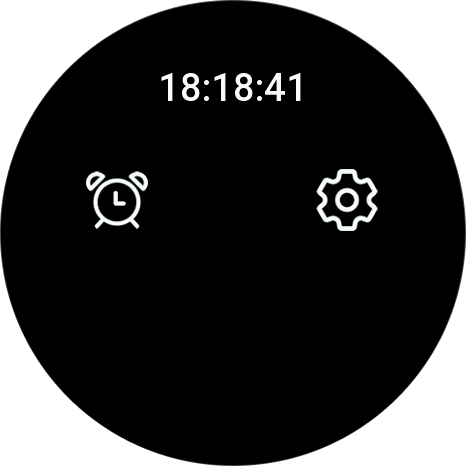
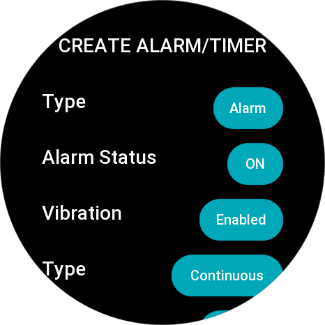
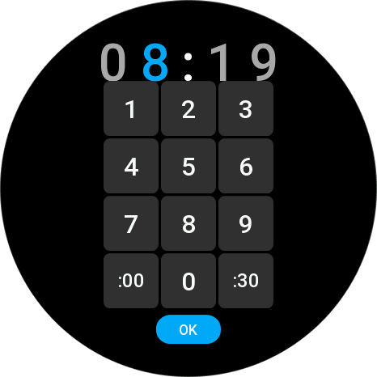
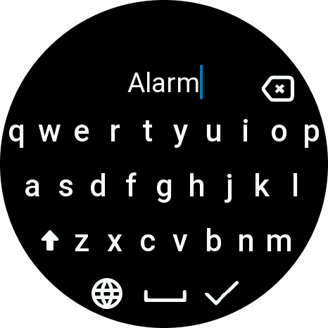
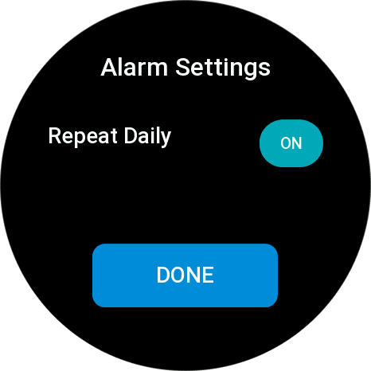
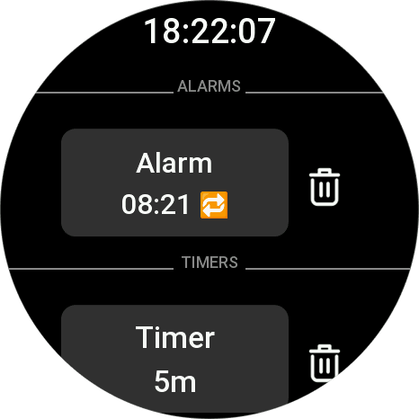
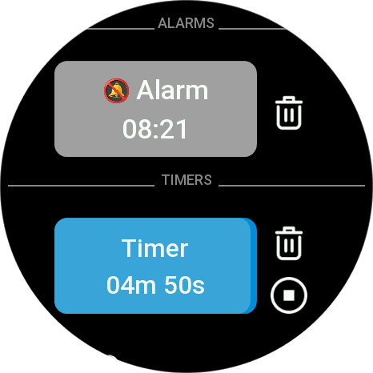
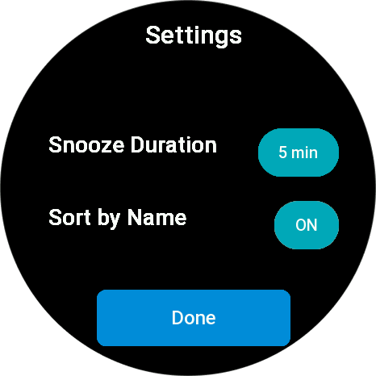
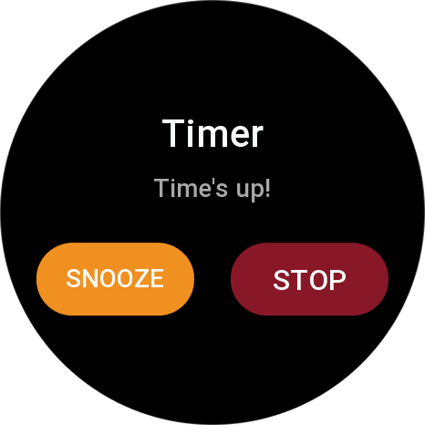
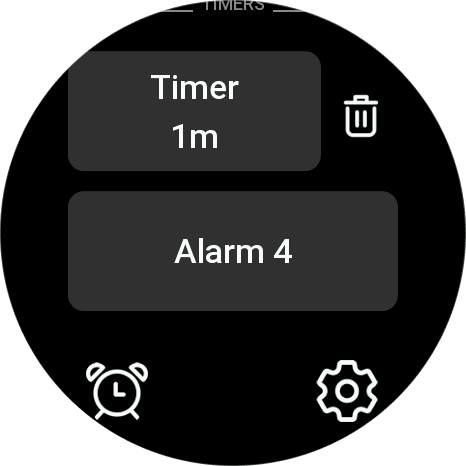

# ZeppOS Smart Timers - User Guide

## Table of Contents
1. [Overview](#overview)
2. [Main Screen](#main-screen)
3. [Creating Alarms](#creating-alarms)
4. [Managing Your Alarms/Timers](#managing-your-alarmstimers)
5. [Settings](#settings)
6. [When an Alarm/Timer Fires](#when-an-alarmtimer-fires)
7. [Quick Tips](#quick-tips)

---

## Overview

ZeppOS Smart Timers is an advanced timer and alarm application for ZeppOS smartwatches featuring:
- Multiple timers with countdown
- Scheduled alarms with repeat options
- Custom vibration patterns per alarm/timer
- Sound alerts
- Snooze functionality
- Native keyboard integration

---

## Main Screen

  

When you first open the app, you'll see the initial startup page with two options:

- **Alarm icon** (left) - Tap to create a new alarm or timer
- **Settings icon** (right) - Tap to access app settings

---

## Creating Alarms

### Step 1: Choose Type and Settings

  

When you tap the alarm icon from the main screen, the **Create Alarm/Timer** screen appears with the following options:

#### Type
- **Alarm** - Schedule an alarm for a specific time
- **Timer** - Create a countdown timer

#### Alarm Status
- **ON** - Alarm is active and will ring at scheduled time
- **OFF** - Alarm is saved but disabled (can be enabled later by editing)

#### Vibration
- **Enabled** - Watch will vibrate when alarm fires
- **Disabled** - No vibration

#### Vibration Type
- **Continuous** - Vibration continues until dismissed
- **Non-continuous** - Vibration pattern with pauses

#### Sound (shown below this screen)
- **ON** - Plays alarm sound
- **OFF** - Silent alarm (vibration only)

---

### Step 2: Set the Time

  

After configuring your alarm/timer settings, you'll see the **Time Picker** screen:

**For Alarms:** Enter the specific time you want the alarm to ring (e.g., 08:19 for 8:19 AM)

**For Timers:** Enter the countdown duration (e.g., 08:19 for 8 minutes and 19 seconds)

#### Using the Time Picker:
- Tap numbers **1-9, 0** to enter time
- Tap **:00** to quickly set minutes to :00
- Tap **:30** to quickly set minutes to :30
- Tap **OK** when finished

The time displays at the top as you type, with the current digit highlighted in blue.

---

### Step 3: Name Your Alarm

  

After setting the time, you'll be prompted to name your alarm or timer. Each alarm and timer can have its own unique name for easy identification.

#### Using the Keyboard:
- Type a descriptive name using the native ZeppOS keyboard
- Tap the **×** button to delete characters
- Tap the **globe** icon to change keyboard language
- Tap the **space bar** to add spaces
- Tap the **checkmark** when finished

**Examples:** "Morning Alarm", "Workout Timer", "Meeting Reminder", "Tea Timer"

---

### Step 4: Configure Repeat Settings

  

After naming your alarm, you'll see the **Alarm Settings** screen where you can configure how the alarm repeats:

#### Repeat Daily
- **ON** - Alarm will ring every day at the scheduled time
- **OFF** - One-time alarm (will only ring once, then automatically disable)

Tap **DONE** to save your alarm and return to the main screen.

---

## Managing Your Alarms/Timers

  

Once created, your alarms and timers appear on the main screen, organized into two sections:

### ALARMS Section
- Shows alarm name ("Alarm")
- Displays scheduled time (08:21)
- **🔁 Icon** - Indicates a repeating daily alarm
- **Trash icon** - Tap to delete the alarm

### TIMERS Section
- Shows timer name ("Timer")
- Displays duration (5m = 5 minutes)
- **Trash icon** - Tap to delete the timer

---

### Starting Timers and Editing Items

  

#### Starting and Stopping Timers
- **Tap timer card** - Start the countdown timer
- **Stop button (■)** - Appears when timer is running; tap to stop
- **Running timer** - Displays remaining time with countdown (e.g., "04m 50s")

#### Editing Alarms and Timers
- **Alarms** - Single tap to edit alarm settings
- **Timers** - Long press and hold to edit timer settings

#### Alarm Status Icons
Alarms display status icons next to their name:

- **🔔🚫 Inactive icon** - Alarm is saved but turned OFF (will not ring)
- **🔁 Repeat icon** - Alarm is set to repeat daily
- **No icon** - One-time alarm that is active

---

## Settings

  

Access the **Settings** screen by tapping the settings icon (gear) from the main screen.

### Snooze Duration
Tap the duration button to cycle through snooze options:
- **5 min** - Snooze for 5 minutes
- **10 min** - Snooze for 10 minutes
- **15 min** - Snooze for 15 minutes
- (cycles through default values)

This controls how long alarms will snooze when you tap the snooze button.

### Sort by Name
- **ON** - Alarms and timers are sorted alphabetically within their categories
- **OFF** - Items appear in the order they were created

Tap **Done** to save your settings.

---

## When an Alarm/Timer Fires

  

When an alarm rings or timer expires, a full-screen popup appears with the alarm/timer name and "Time's up!" message.

### Your Options:

**SNOOZE (Orange button)**
- Delays the alarm based on your snooze duration setting (5, 10, or 15 minutes)
- Creates a new temporary alarm that will fire after the snooze duration
- The popup will appear again when the snooze time expires
- Repeat as many times as needed

**STOP (Red button)**
- Dismisses the alarm completely
- One-time alarms are automatically disabled
- Daily alarms remain active for tomorrow

### After Snoozing

  

After snoozing, the snoozed alarm/timer appears on the main screen showing the remaining time until it fires again (e.g., "Timer 1m" = 1 minute remaining).

---

## Quick Tips

### Best Practices
- **Name your alarms descriptively** - Makes them easier to identify at a glance
- **Use timers for short durations** - Perfect for cooking, workouts, or breaks
- **Set daily alarms for routines** - Morning wake-up, medication reminders, etc.
- **Disable unused alarms** - Keep your list clean by turning off or deleting old alarms

### Editing Shortcuts
- **Single tap alarms** to edit them quickly
- **Long press timers** to modify their settings
- **Tap trash icon** for instant deletion

### Managing Multiple Alarms
- Enable **Sort by Name** in settings for easier navigation
- Use clear naming conventions (e.g., "Morning", "Evening", "Workout")
- Keep only active alarms enabled to avoid confusion

---

**Need help?** Report issues or request features at [GitHub Issues](https://github.com/ether-strannik/zeppos-smart-timers/issues)
